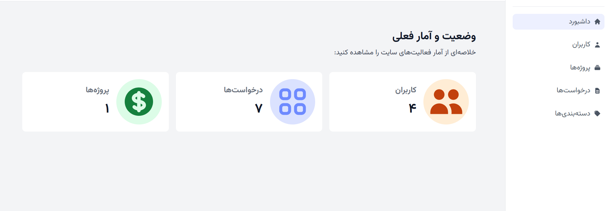
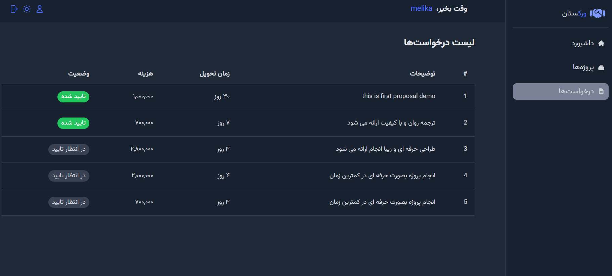

# 🎯 اپلیکیشن فریلنسینگ | FreelancingApp

این پروژه یک اپلیکیشن کامل برای مدیریت ارتباط بین **کارفرما، فریلنسر و ادمین** است. این سیستم تحت وب با استفاده از **React** و ابزار مدرن **Vite** توسعه داده شده و دارای پنل‌های اختصاصی برای هر نقش، احراز هویت امن، طراحی ریسپانسیو و رابط کاربری حرفه‌ای است.

---

## 🚀 دمو آنلاین

🔗 [مشاهده دمو](https://freelancingapp.vercel.app)  

---

## 📸 اسکرین‌شات‌ها

> برای نمایش بهتر امکانات پروژه، اسکرین‌شات‌ها از صفحات اصلی قرار داده شده‌اند:

| صفحه اصلی | پنل ادمین | پنل کارفرما | پنل فریلنسر |
|-----------|------------|-------------|--------------|
|  |  |  |  |


---

## ✨ ویژگی‌ها

- احراز هویت با JWT و کوکی امن
- پنل‌های جداگانه برای نقش‌های مختلف (ادمین، فریلنسر، کارفرما)
- طراحی داینامیک با layout اختصاصی برای هر نقش
- دارک‌مود و رابط کاربری روان و واکنش‌گرا
- مدیریت پروفایل و تنظیمات کاربری
- روت‌های محافظت‌شده با سطوح دسترسی مختلف
- استفاده از Context و React Query برای مدیریت وضعیت

---

## 🛠️ تکنولوژی‌ها

| تکنولوژی  | استفاده |
|-----------|---------|
| React     | رابط کاربری |
| Vite      | ساخت و اجرای سریع پروژه |
| TailwindCSS | طراحی UI ریسپانسیو |
| React Router Dom | مسیردهی SPA |
| React Hook Form | مدیریت فرم‌ها |
| Axios     | ارتباط با API بک‌اند |
| React Query | مدیریت داده‌ها و کش |
| Framer Motion | انیمیشن‌ها |

---

## 🧩 نصب و اجرای پروژه

ابتدا ریپازیتوری را کلون کنید:

```bash
git clone https://github.com/auroraEros/freelancingApp.git
cd freelancingApp
npm install
npm run dev


